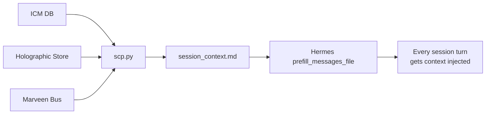

# SCP — Session Context Pre-fill for Hermes Agent

**Zero-effort context continuity across Hermes sessions.**  
Automatically injects persistent context (ICM, Holographic Memory, Marveen state) into every Hermes session — so your agents always know what happened before.

---

## 🚀 The Problem

Hermes Agent starts each fresh session with no knowledge of:
- What you worked on in previous sessions
- What facts the system has learned about you and your projects
- What other agents have done on your behalf
- What inter-agent messages are pending

The result: agents are blind every time they start, you repeat yourself, and the "continuous assistant" illusion breaks.

## ✅ The Solution

SCP collects data from **three memory backends** at regular intervals (via cron), writes a `session_context.md` file, and Hermes' built-in `prefill_messages_file` mechanism injects that context into **every user message** in **every session** — without the agent doing anything.



## ✨ Features

- **Three memory sources** in one file:
  - 🧠 **ICM** (Infinite Context Memory) — active topics, recent entries, high-importance items
  - 💾 **Holographic Memory** (fact_store) — trusted facts about you, your projects, your tools
  - 🌙 **Marveen Dream Engine** — latest nightly consolidation report
- **Profile-agnostic** — works with any Hermes profile (dev, research, study, general, custom)  
- **Watchdog mode** — silent on success, errors only when something breaks (ideal for cron)
- **Zero agent overhead** — uses Hermes' built-in `prefill_messages_file` kernel feature, no plugins, no hooks
- **Human + machine readable** — markdown format, model injection ready

## 📋 Requirements

- Python 3.8+ (stdlib only — no pip dependencies)
- Hermes Agent with one or more profiles using:
  - ICM (`icm` CLI installed and in PATH)
  - Holographic Memory (`memory_enabled: true`)
  - _(Marveen Message Bus is optional — SCP gracefully skips missing sources)_

## 🔧 Installation

### Quick install (recommended)

```bash
# Clone the repo
git clone https://github.com/kriszmac4/scp.git ~/scp
cd ~/scp

# Run the setup script
bash setup.sh
```

The setup script will:
1. Symlink `scp.py` to your active profile's scripts directory
2. Add the `prefill_messages_file` config to your Hermes profile config
3. Create a cron job to refresh the context every hour

### Manual install

```bash
# 1. Copy the script
mkdir -p ~/.hermes/profiles/dev/scripts
cp scp.py ~/.hermes/profiles/dev/scripts/scp.py

# 2. Add to your ~/.hermes/profiles/<profile>/config.yaml:
#    prefill_messages_file: '/home/<user>/.hermes/profiles/<profile>/data/session_context.md'

# 3. Create a cron job (runs every hour)
hermes cron session-context-prefill --schedule "every 1h" --no-agent \
  "python3 ~/.hermes/profiles/<profile>/scripts/scp.py --profile <profile> --watchdog"

# Or with system cron:
# 0 * * * * python3 ~/.hermes/profiles/<profile>/scripts/scp.py --profile <profile> --watchdog
```

### Multiple profiles

Create one cron job per profile:

```bash
python3 ~/.hermes/profiles/dev/scripts/scp.py --profile dev --watchdog
python3 ~/.hermes/profiles/research/scripts/scp.py --profile research --watchdog
```

## 🎮 Usage

### Manual run

```bash
# Default (dev profile)
python3 ~/.hermes/profiles/dev/scripts/scp.py

# Specific profile
python3 scp.py --profile research

# Custom Hermes home
python3 scp.py --hermes-home /opt/hermes --profile general

# Custom output path
python3 scp.py --profile dev --output /tmp/context.md

# Watchdog mode (silent on success)
python3 scp.py --profile dev --watchdog

# No-argument mode (uses HERMES_HOME + HERMES_PROFILE env vars)
env HERMES_PROFILE=study python3 ~/.hermes/profiles/study/scripts/scp.py
```

### CLI Reference

```
usage: scp.py [-h] [--profile PROFILE] [--hermes-home HERMES_HOME]
              [--output OUTPUT] [--watchdog] [--version]

SCP — Session Context Pre-fill for Hermes Agent

options:
  -h, --help            show this help message and exit
  --profile PROFILE, -p PROFILE
                        Hermes profile name (default: dev, or $HERMES_PROFILE)
  --hermes-home HERMES_HOME, -H HERMES_HOME
                        Hermes root path (default: ~/.hermes, or $HERMES_HOME)
  --output OUTPUT, -o OUTPUT
                        Output file path (default: auto-detected from profile)
  --watchdog, -w        Watchdog mode: silent on success, non-zero exit on error
  --version, -v         show program's version and exit
```

### Environment variables

| Variable | Purpose | Default |
|----------|---------|---------|
| `HERMES_HOME` | Path to Hermes root | `~/.hermes` |
| `HERMES_PROFILE` | Profile name | `dev` |

## 🔄 How it works

### 1. Data collection loop

The script runs as a **cron job** (recommended: every hour). Each tick it:

1. **ICM DB** (`~/.hermes/profiles/<profile>/home/.local/share/icm/memories.db`):
   - Top 10 active topics (by entry count × weight)
   - Top 5 recent entries
   - Top 5 high-importance entries (critical/high)

2. **Holographic Memory Store** (`~/.hermes/profiles/<profile>/memory_store.db`):
   - Top 6 facts sorted by helpful-to-retrieval ratio with trust ≥ 0.3

3. **Marveen Dream Engine** (`~/.hermes/profiles/<profile>/data/marveen/dreams/`):
   - Latest `.md` report preview (first 500 chars)

4. **Marveen Bus** (`~/.hermes/profiles/<profile>/data/marveen/agent_messages.db`):
   - Count of pending/delivered undelivered messages

### 2. Kernel-side injection

Hermes' native `prefill_messages_file` config option reads `session_context.md` before **every new session** and injects its content as a system-prompt pre-fill message — the first thing the agent sees after the system prompt.

### 3. Watchdog cron pattern

When `--watchdog` is set:
- **Success** → exits 0, stdout is empty → cron delivers nothing (no spam)
- **Error** → exits 1 → error message to stderr → you get notified

This means: **completely silent when everything works, alerts you when something breaks.**

## 🏗 Output format

```markdown
# 📋 Session Context — SCP v1.0.0
_Updated: 2026-06-08 16:00:00 UTC_
_Hermes: /home/user/.hermes | Profile: dev_

📚 **ICM — Active Topics:**
  • errors-resolved: 12 entries (avg weight: 0.85)
  • context-project-manager: 8 entries (avg weight: 0.72)
  …

🆕 **ICM — Recent Entries:**
  • Fixed TypeORM migration conflict (topic: errors-resolved) [high]
  …

⭐ **ICM — Critical / High Importance:**
  • [preferences] User prefers Hungarian (w=0.95)
  …

🧠 **Holographic Memory — Key Facts:**
  • [user_pref] Uses pytest with xdist for parallel testing (trust: 0.9) (3/5 helpful)
  …

📨 **Marveen Bus — Pending Messages:** 2

---
_Generated by SCP (Session Context Pre-fill) — refreshed by cron._
```

## 🐛 Debugging

```bash
# Test: run the script manually with --watchdog (will be silent on success)
python3 ~/.hermes/profiles/dev/scripts/scp.py --profile dev --watchdog
echo $?   # 0 = success

# Verbose mode (see output)
python3 ~/.hermes/profiles/dev/scripts/scp.py --profile dev

# Check what was generated
cat ~/.hermes/profiles/dev/data/session_context.md

# Verify config.yaml has the prefill line
grep prefill_messages_file ~/.hermes/profiles/dev/config.yaml
```

## 📄 License

MIT — see [LICENSE](LICENSE)
