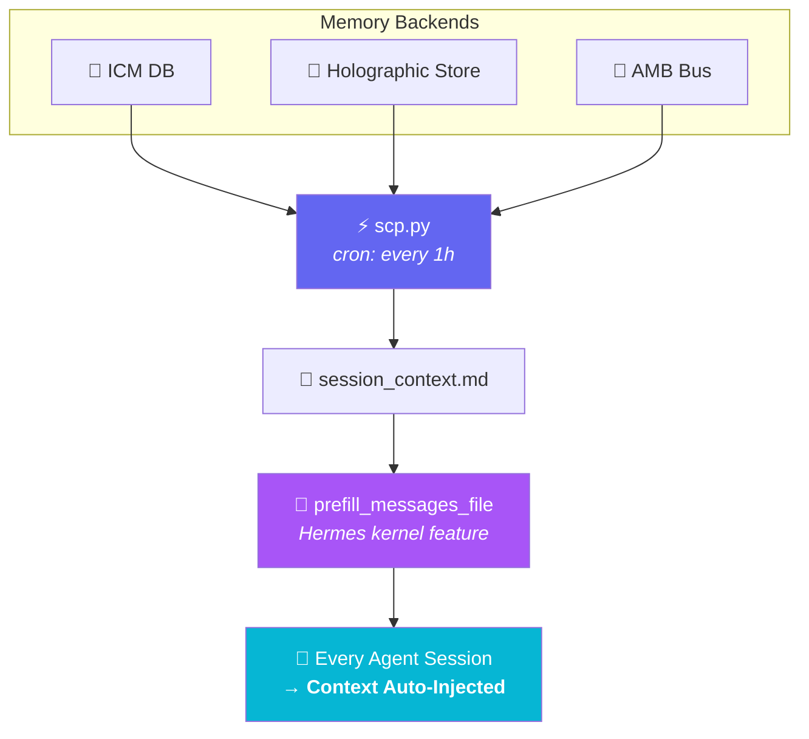

<picture>
  <source media="(prefers-color-scheme: dark)" srcset="media/scp-banner.svg">
  
</picture>

<br>

<div align="center">

[](LICENSE)
[]()
[]()
[]()
[]()

</div>

---

**Zero-effort context continuity across Hermes sessions.**  
Automatically injects persistent context (ICM, Holographic Memory, Marveen state) into every Hermes session — so your agents always know what happened before.

---

## 🚀 The Problem

Hermes Agent starts each fresh session with **blank context**. It doesn't know:

- 🧵 What you discussed in previous sessions
- 🧠 What facts the system has learned about you and your projects
- 🤖 What other agents have done on your behalf
- 📨 What inter-agent messages are still pending

The result: agents are blind every time they start, you repeat yourself, and the "continuous assistant" illusion breaks.

## ✅ The Solution

**SCP** connects three memory backends into a single context file that Hermes injects into every session — automatically, silently, every hour.



**No plugins. No hooks. No agent cooperation required.** It's a kernel-level pre-fill that happens before the agent even initializes.

## ✨ Features

| Feature | Details |
|---------|---------|
| 🧠 **ICM Context** | Active topics, recent entries, high-importance memories |
| 💾 **Holographic Facts** | Trusted facts sorted by helpful-to-retrieval ratio |
| 🌙 **Marveen State** | Latest Dream Engine report + pending bus messages |
| 🔄 **Profile-Agnostic** | Works with `dev`, `research`, `study`, `general`, any custom profile |
| 🐶 **Watchdog Mode** | Silent on success, alerts on failure — perfect for cron |
| 🔌 **Zero Overhead** | Uses Hermes' built-in `prefill_messages_file` — no plugins, no hooks |
| 📦 **No Dependencies** | Pure Python stdlib — `pip install` not required |

## 📋 Requirements

| Component | Required |
|-----------|----------|
| Python | 3.8+ (stdlib only) |
| Hermes Agent | Any profile |
| ICM CLI | `icm` installed and in `PATH` |
| Holographic Memory | `memory_enabled: true` in config |
| AMB Bus | Optional — gracefully skipped if missing |

## 🔧 Installation

### Option 1: Quick Install (recommended)

```bash
git clone https://github.com/kriszmac4/scp.git ~/scp
cd ~/scp
bash setup.sh
```

The script will:
1. Copy `scp.py` to your profile's scripts directory
2. Add `prefill_messages_file` to your Hermes config
3. Run the initial context generation

### Option 2: Manual Install

```bash
# 1. Install the script
mkdir -p ~/.hermes/profiles/dev/scripts
cp scp.py ~/.hermes/profiles/dev/scripts/

# 2. Add to config.yaml
#    prefill_messages_file: '/home/<user>/.hermes/profiles/<profile>/data/session_context.md'

# 3. Create a cron job (runs every hour)
hermes cron session-context-prefill --schedule "every 1h" --no-agent \
  "python3 ~/.hermes/profiles/<profile>/scripts/scp.py --profile <profile> --watchdog"

# Or with system cron:
# 0 * * * * python3 ~/.hermes/profiles/<profile>/scripts/scp.py --profile <profile> --watchdog
```

### Multiple Profiles

```bash
# One cron job per profile
python3 ~/.hermes/profiles/dev/scripts/scp.py --profile dev --watchdog
python3 ~/.hermes/profiles/research/scripts/scp.py --profile research --watchdog
```

## 🎮 Usage

### Quick Reference

```bash
# Default (dev profile)
python3 ~/.hermes/profiles/dev/scripts/scp.py

# Specific profile
python3 scp.py --profile research

# Custom Hermes installation path
python3 scp.py --hermes-home /opt/hermes --profile general

# Watchdog mode (silent on success — for cron)
python3 scp.py --profile dev --watchdog

# Custom output path
python3 scp.py --profile dev --output /tmp/context.md

# Using environment variables
env HERMES_PROFILE=study python3 scp.py
```

### CLI Reference

```
usage: scp.py [-h] [--profile PROFILE] [--hermes-home HERMES_HOME]
              [--output OUTPUT] [--watchdog] [--version]

SCP — Session Context Pre-fill for Hermes Agent

options:
  -h, --help                    Show this help message
  --profile PROFILE, -p         Hermes profile name
                                (default: dev, or $HERMES_PROFILE)
  --hermes-home HERMES_HOME, -H Hermes root path
                                (default: ~/.hermes, or $HERMES_HOME)
  --output OUTPUT, -o           Output file path
                                (default: auto-detected from profile)
  --watchdog, -w                Silent on success, non-zero exit on error
  --version, -v                 Show version and exit
```

### Environment Variables

| Variable | Purpose | Default |
|----------|---------|---------|
| `HERMES_HOME` | Path to Hermes root | `~/.hermes` |
| `HERMES_PROFILE` | Profile name | `dev` |

## 🔄 How It Works

### Data Collection Pipeline

The script runs as a cron job (recommended interval: every hour). Each execution:

| Step | Source | What Gets Collected |
|------|--------|-------------------|
| 1 | **ICM DB**<br>`profiles/<p>/home/.local/share/icm/memories.db` | Top 10 active topics (by count × weight), 5 most recent entries, 5 high-importance items |
| 2 | **Holographic Store**<br>`profiles/<p>/memory_store.db` | Top 6 trusted facts (sorted by helpful-to-retrieval ratio, trust ≥ 0.3) |
| 3 | **AMB Dreams**<br>`profiles/<p>/data/agent_message_bus/dreams/` | Latest `.md` consolidation report preview (first 500 chars) |
| 4 | **AMB Bus**<br>`profiles/<p>/data/agent_message_bus/agent_messages.db` | Count of pending/delivered inter-agent messages |

### Kernel-Side Injection

Hermes' native `prefill_messages_file` config option reads `session_context.md` before **every new session** and injects it as the first thing the agent sees — right after the system prompt. This means:

- ✅ Every session starts with full context
- ✅ No agent code changes needed
- ✅ Works across all profiles simultaneously
- ✅ Zero latency (file is read once at session init)

### Watchdog Cron Pattern

```
┌─────────────────────────────────────┐
│  scp.py --watchdog runs             │
│         ↓                           │
│  ┌─── Success ──→ exit 0 ──→ silent │
│  └─── Error   ──→ exit 1 ──→ alert  │
└─────────────────────────────────────┘
```

**Completely silent when everything works. Alerts you when something breaks.**

## 🏗 Output Example

```markdown
# 📋 Session Context — SCP v1.0.0
_Updated: 2026-06-08 16:00:00 UTC_
_Hermes: /home/user/.hermes | Profile: dev_

📚 **ICM — Active Topics:**
  • errors-resolved: 12 entries (avg weight: 0.85)
  • context-project-manager: 8 entries (avg weight: 0.72)

🆕 **ICM — Recent Entries:**
  • Fixed TypeORM migration conflict (topic: errors-resolved) [high]

⭐ **ICM — Critical / High Importance:**
  • [preferences] User prefers concise responses (w=0.95)

🧠 **Holographic Memory — Key Facts:**
  • [user_pref] Uses pytest with xdist (trust: 0.9) (3/5 helpful)

📨 **AMB Bus — Pending Messages:** 2
```

## 🐛 Debugging

```bash
# Test the script (silent on success in watchdog mode)
python3 ~/.hermes/profiles/dev/scripts/scp.py --profile dev --watchdog
echo $?   # 0 = all good

# Manual run with output
python3 ~/.hermes/profiles/dev/scripts/scp.py --profile dev

# Inspect the generated context
cat ~/.hermes/profiles/dev/data/session_context.md

# Verify Hermes config
grep prefill_messages_file ~/.hermes/profiles/dev/config.yaml

# Force a cron job to run immediately
hermes cron run session-context-prefill
```

## 🤝 Contributing

PRs welcome! If you have ideas for additional context sources, better formatting, or support for more Hermes profile configurations, open an issue or submit a pull request.

## 📄 License

MIT — see [LICENSE](LICENSE)

---

<p align="center">
  <sub>Built with ❤️ for the <a href="https://hermes-agent.nousresearch.com">Hermes Agent</a> community</sub>
</p>
